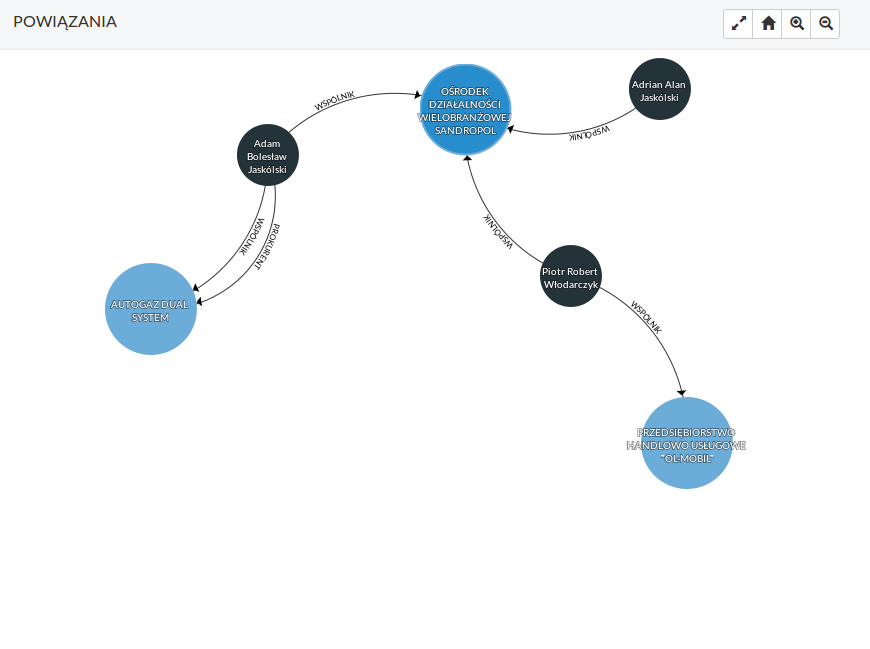
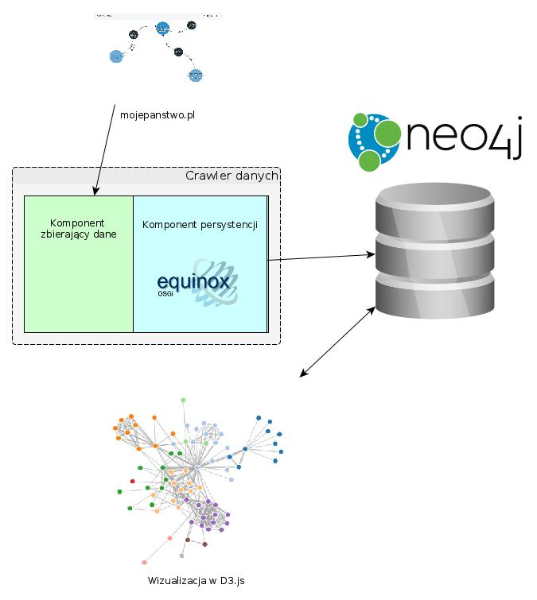

# Znajdowanie i wizualizacja powiązań między osobami

Autorzy:

- Jacek Kowalski
- Aleksander Książek

# Wizja systemu

## Ogólna idea

W Internecie można znaleźć wiele powiązań między osobami (m.in. osoby w jednej radzie nadzorczej, w tym samym samorządzie gminnym itp.). Żaden z serisów nie agreguje jednak danych z wielu źródeł, by umożliwić wyszukiwanie różnych rodzajów związków między ludźmi - rozwiązanie takie mogłoby umożliwić społeczną kontrolę nad osobami publicznymi.

## Dekompozycja problemu

* pobieranie danych (API, crawler, komponenty) - (Moje państwo - API)[http://mojepanstwo.pl/api/technical_info]
* przechowywanie (baza grafowa)
* wyszukiwanie (API)
* wyświetlanie (część użytkowa - JS)

## Wymagania funkcjonalne

* mieć możliwość znalezienia powiązania między dwoma osobami - podając imię i nazwisko powinniśmy, na podstawie dostępnych danych, otrzymać łączącą je ścieżkę w grafie powiązań między osobami,

* mieć możliwość wizualizacji powiązań danej osoby (graf osób, z którymi zasiada w jednej radzie nadzorczej/sejmiku/radzie gminy itp.) oraz jego przeglądania,
	* wizualizacja kilku poziomów powiązań,
	* rodzaj powiązania na krawędziach grafu.
	* informacja o funkcjach pełnionych przez osobę na wierzchołku grafu

* zawierać w sobie dane o powiązaniach między osobami przynajmniej na podstawie:
	* listy posłów i senatorów,
	* list radnych,
	* danych o zarządzach firm/stowarzyszeń z Krajowego Rejestru Sądowego.

* szukanie przecięć grafów związanych z różnymi grupami społecznymi,

* udostępniać API/komponent umożliwiający import nowych źródeł danych

## Istniejące podobne projekty

(Moje Państwo)[http://mojepanstwo.pl/krs] - pozwala na minimalistyczną wizualizację najbliższych powiązań dla encji z KRS



(Zbiór linków do różnych narzędzi do analizy sieci społecznych)[http://www.kstoolkit.org/Social+Network+Analysis]

## Stos technologiczny

* Java do web crawlera (OSGi)
* Neo4j jako baza danych i silnik wyszukiwań
* HTML / JavaScript (D3.js, Sigma.js) do wizualizacji

# Architektura systemu



System będzie składał się z następujących elementów:

## Komponentowy crawler

Crawler ma za zadanie zbierać dane wykorzystywane do znajdowania powiązań, przetwarzać je do postaci właściwej dla bazy danych i zapisywać je.

Wykorzystana zostanie technologia OSGi - implementacja Eclipse Equinox.

### Komponent persystencji #

Komponent persystencji łączy się z bazą danych i udostępnia API:

```
persist(GroupData, List<Person>)
```

umożliwiające zapis osób, które są ze sobą powiązane (każda z każdą) wraz z informacjami o samym powiązaniu.

Minimalna ilość informacji to:

* GroupData
  * id - unikalny identyfikator grupy (np. numer KRS)
  * source - nazwa źródłowego zbioru danych (np. KRS)
  * name - nazwa grupy w zbiorze danych (np. nazwa firmy)
* Person
  * name - imię i nazwisko

Dodatkowo mogą być przechowywane:

* GroupData
  * begin - data rozpoczęcia relacji
  * end - data zakończenia relacji
* Person
  * id - identyfikator użytkownika
  * birth - data urodzenia
  * tags - informacje o szczególnych relacjach (np. poseł na sejm 2011-2015)

### Komponenty zbierające dane #

Komponenty te, wykorzystując publiczne API serwisu Moje Państwo (http://mojepanstwo.pl/api/technical_info), winny przekazywać porcje danych do komponentu persystencji.

Musi istnieć możliwość zatrzymania i wznowienia komponentów tak, by nie rozpoczynał on za każdym razem pracy od zera.

Zapimplementowane zostanie pobieranie:

* danych o firmach, fundacjach i stowarzyszeniach z bazy KRS,
* pobieranie listy posłów i ich współpracowników,
* pobieranie listy radnych (gdzie dostępne),
* pobieranie listy urzędników (gdzie dostępne).

## Baza danych

Dane o powiązaniach będą przechowywane w bazie danych Neo4J. Wierzchołkami grafu będą poszczególne osoby (Person), wraz z ich atrybutami, zaś krawędzie stanowią powiązania. Grupę stanowi klika w grafie, złożona z krawędzi o takim samym identyfikatorze powiązania.

Baza udostępnia API REST umożliwiające wykonywanie wszelkich zapytań na danych (znalezienie wierzchołka, drogi, osób powiązanych, przecięcia grup).

## Interfejs

Po stronie użytkownika aplikacja będzie dostępna jako aplikacja internetowa pisana w HTML i (Vanilla JS)[http://vanilla-js.com/] z wizualizacjami w D3.js (+ ew. Sigma.js). Zapytania o dane będą wykonywane bezpośrednio do bazy Neo4J.

Wyróżnione zostaną elementy:

* komunikacji z bazą danych (nakładka nad AJAX): proste wyszukiwania + zapytania SQL,
* moduły obsługujące zapytania i wizualizację:
  * powiązań wybranej osoby (krawędzie wychodzące z węzła do wybranej głębokości),
  * powiązań między dwoma osobami (ścieżka w grafie i jej odnogi),
  * części wspólnych dwóch grup (osoby wspólne dla obu grup lub powiązania między nimi),
* moduł obsługi interfejsu graficznego (części wspólne dla wszystkich modułów).

# Komponenty

Komponenty są zaimplementowane w technologii OSGi

## ConfigInterface

Serwis z interfejsem umożliwiającym dostęp do danych konfiguracyjnych, stworzony na bazie interfejsu Properties:

```
package pl.edu.agh.ki.toik.sna.crawler.krs;
public interface ConfigInterface {
	public String getProperty(String key);
	public String getProperty(String key, String defaultValue);
	public void setProperty(String key, String value);
}
```

## ConfigService

Plugin implementujący ConfigInterface.

## Crawler KRS

Plugin - crawler danych KRS - przy uruchomieniu pobiera dane z ConfigInterface (crawler.krs.page - ostatnio pobrana strona danych) i zaczyna ściąganie danych.

## Crawler Parliament

Crawler danych o parlamentarzystach - przy uruchomieniu pobiera dane z ConfigInterface (crawler.krs.parliament - ostatnio pobrana strona danych) i zaczyna ściąganie danych.

## PersistenceInterface

Interfejs umożliwiający zapis ściągniętych danych:

```
package pl.edu.agh.ki.toik.sna.persistence.iface;

public interface Persister {
	public void persist(GroupData groupData, List<Person> people);
}

public class GroupData {
	public String id # null;
	public String source # null;
	public String name # null;
}

public class Person {
	public Integer id # null;
	public String name # null;
}
```

## PersistenceStdout

Usługa wypisująca dane na standardowe wyjście, implementująca PersistanceInterface.

## PersistenceStdout

Usługa zapisująca dane w bazie Neo4j, implementująca PersistanceInterface i wykorzystująca ConfigInterface - (ustawienia: neo4j.url, neo4j.user, neo4j.pass).

# Instrukcja instalacji i uruchomienia

## Crawler

Uwaga! Crawler wymaga działającej instancji bazy Neo4j.

Instrukcja instalacji i uruchomienia:

1. Sklonować repozytorium do wybranego folderu.
2. Do katalogu Resty/lib należy pobrać (resty-0.3.1.jar)[http://central.maven.org/maven2/us/monoid/web/resty/0.3.1/resty-0.3.1.jar]
3. Do katalogu PersistenceNeo4j/lib należy pobrać (neo4j-jdbc-2.1.4-jar-with-dependencies.jar)[https://m2.neo4j.org/service/local/artifact/maven/redirect?r#releases&g#org.neo4j&a#neo4j-jdbc&v#2.1.4&e#jar&c#jar-with-dependencies]
4. Zaimportować project do Eclipse for RCP Developement (File -> Import -> Existing Projects into Workspace).
5. W katalogu uruchomieniowym utworzyć plik config.ini, w którym należy podać informacje potrzebne do połączenia z bazą danych:

	```ini
	neo4j.url = http://127.0.0.1:7474
	neo4j.user = neo4j
	neo4j.pass = neo4j
	```

6. Uruchomić komponenty (wraz z zależnościami):

- ConfigService (pl.edu.agh.ki.toik.sna.config),
- PersistenceNeo4j (pl.edu.agh.ki.toik.sna.persistence.neo4j),
- CrawlerKRS (pl.edu.agh.ki.toik.sna.crawler.krs),
- CrawlerParliament (pl.edu.agh.ki.toik.crawler.parliament).

7. Po zakończeniu crawlingu, dodać indeksy na bazie:

	```sql
	CREATE INDEX ON :Person(name)
	CREATE INDEX ON :RELATED(name)
	```

## Część użytkowa

Część użytkowa znajduje się w repozytorium w katalogu html/.

1. W pliku index.html, w linii:

	```js
	neo4j_settings = {
		url: 'http://127.0.0.1:7474', user: 'neo4j', password: 'admin'
	};
	```

	podać dane do połączenia z bazą.

2. Część użytkowa umożliwia:

- wizualizację grafu powiązań danej osoby (opcja Person) - należy podać osobę w postaci "Nazwisko Imię" (lub prefiks takiego identyfikatora; wielkość liter ma znaczenie),
- wizualizację połączenia między osobami (max. 10 krawiędzi; opcja Connection) - należy podać dwie osoby w postaci "Nazwisko Imię" (lub prefiks takiego identyfikatora; wielkość liter ma znaczenie),
- wizualizacja danej grupy (opcja Group) - należy podać "Nazwa firmy" (lub prefiks takiego identyfikatora; wielkość liter nie ma znaczenia),
- wizualizacja przecięcia danej grupy (opcja Intersection) - należy podać dwie firmy w postaci "Nazwa firmy" (lub prefiks takiego identyfikatora; wielkość liter nie ma znaczenia).

# Zbiory danych

Wykorzystywane są zbiory danych z portalu http://mojepanstwo.pl/ :

- dane o firmach i stowarzyszeniach z Krajowego Rejestru Sądowego,
- dane parlamentarzystów.

Ściągnięte części zbiorów zawierały:

- 18 661 osób,
- 44 790 relacji.

# Reprezentacja danych

Dane są zapisywane w grafowej bazie danych. Wierzchołkami grafu są osoby wraz z atrybutem - imieniem i nazwiskiem. Powiązania są zapisywane jako krawędzie między wierzchołkami, wraz z atrybutami - identyfikatorem (np. numerem KRS) oraz nazwą (firmy, którą reprezentują lub nazwą powiązania).
